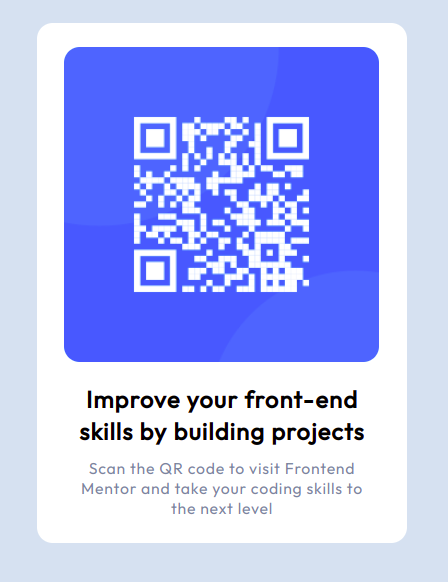

# Frontend Mentor - QR code component solution

This is a solution to the [QR code component challenge on Frontend Mentor](https://www.frontendmentor.io/challenges/qr-code-component-iux_sIO_H). Frontend Mentor challenges help you improve your coding skills by building realistic projects.

## Table of contents

- [Overview](#overview)
  - [The challenge](#the-challenge)
  - [Screenshot](#screenshot)
  - [Links](#links)
  - [Built with](#built-with)
  - [Author](#author)

## Overview

### The challenge

Users should be able to:

- View the optimal layout for the app depending on their device's screen size
- Align the QR code in the middle with respective colors

### Screenshots

### Links

- Solution URL: [Solution link](https://www.frontendmentor.io/solutions/qr-code-component-H1F8v4nrq)
- Live Site URL: [Live link](https://qr-code-adh0c.netlify.app/)

### Built with

- Semantic HTML5 markup
- CSS custom properties
- Flexbox
- Mobile-first workflow
- [TailwindCss](https://tailwindcss.com/) - CSS framework

## Author

- Frontend Mentor - [@ad-h0c](https://www.frontendmentor.io/profile/Ad-h0c)
